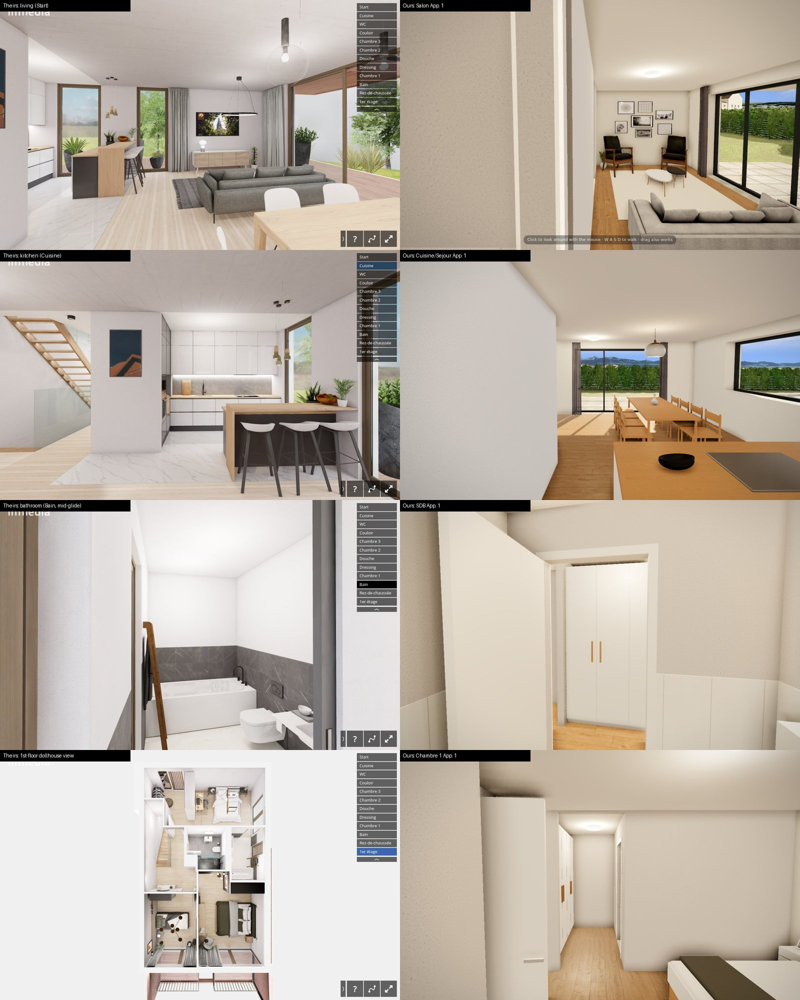

# Interior walk: ours vs the Clos des Hêtres tour (Shapespark), 2026-10-08

Reference: <https://closdeshetres.ch/visite-A03/#autoplay>. It is a **Shapespark** export from 2023-01-31; Shapespark is a commercial
archviz engine. I read its `scene.json`, its shaders and its camera code (`webwalk/walk.min.js`) and downloaded its lightmaps.
Ours was rendered on TestVillaGille v9 on dev (`fa8bd00053e6`, kit `2026-10-04-v9`, presentation look with the surroundings),
on the RTX 3050 (D3D12), in the same 1280×800 window.



*Left, theirs: living room (Start), kitchen (Cuisine), bathroom (Bain, caught mid-glide), the 1st floor's dollhouse view.
Right, ours: Salon, Cuisine / Séjour, SDB, Chambre 1 (all App. 1), each where `startWalk(<room>)` puts the camera.*

## The short version

Their quality comes from three things, in this order:

1. **Baked light.** Every light was computed offline by a path tracer and stored in two 4096² lightmaps. The browser only
   multiplies each surface's texture by its lightmap. That is where the soft gradients, the colour bleeding and the shadow under
   every object come from.
2. **Placed viewpoints and staged rooms.** An artist placed 10 named viewpoints and furnished and decorated every room.
3. **Eased camera motion.** Every move speeds up gently, rounds the corners and ends on a chosen view.

We compute the light live in the browser (#41), and that can't produce this look. Points 2 and 3 are cheap for us, and 3 is
almost entirely `kit/walk.js`.

## How theirs works

### Rendering

| | Theirs |
|---|---|
| Light | 27 lamps (25 point, 1 area, 1 spot), **all baked** into 2 RGBM lightmaps, 4096×4095 and 4096×2944 (26 MB as WebP). The viewer has no live lights, no shadow maps and no ambient-occlusion pass |
| Surface shading | `albedo × lightmap` (bicubic) plus a reflection from a room capture × Fresnel; the reflection is weaker where the lightmap is dark (`mix(0.4, 1, luminance)`). Nothing else |
| Reflections | 10 light probes, box-projected (each mesh tied to one), captured in the browser from the baked scene at load (128 px, mips chosen by glossiness); a planar mirror shader |
| Exposure | fixed: exposure 1, gamma 1, no automatic metering (`ENABLE_AUTO_EXPOSURE_CONTROLS: false`); curve `x / (x + 0.187) × 1.035` (an old Unreal filmic curve); an optional colour LUT |
| Edges | when the camera stops, jittered frames are accumulated; a cheap filter (FXAA) otherwise |
| Textures | ~160 textures, GPU-compressed (Basis), a small version first then a large one; small ones packed into atlases; per-material colour correction (contrast, HSL); bump maps |
| Loading | a cover image and a progress ring at once, then by priority: geometry → textures → lightmaps → sky → reflections. About 105 MB raw (57 MB geometry, served gzipped; 26 MB lightmaps; 22 MB textures): heavier than ours, but something is on screen from the start |
| Extras | a video playing on the TV, WebXR / cardboard VR, gyro on phones, gamepad, a minimap (turned off on this tour), a help overlay |

### Movement

- **Viewpoints:** 10 named views placed by hand. The eye is **1.48 m** above the floor and looks **level** (pitch under 0.6°,
  so vertical lines stay vertical); the field of view is 70°. Each floor also has a **dollhouse** view: an orbit from above,
  cut at the storey.
- **Clicking a view walks there.** The path starts like ours in `walk.js`: a top-down slice of the obstacles at camera height
  → shortest route on a grid (A*) → straightened. On top of that:
  - corners are rounded into cubic Béziers, with a radius of 2–6 depending on how sharp the corner is;
  - speed builds up at a constant 2 m/s² and depends on the corner: about 1 m/s through sharp ones (60° or less), up to
    2.2 m/s where it runs straight; the whole move takes 1.5–6 s;
  - heading eases out of the starting direction (cosine ease) over the first 1.25 m, follows the path, then eases into the
    view's direction over the last 3.75 m. Pitch eases to level over the first 1.75 m, then to the view's over the last 3.25 m;
  - height is eased too, so it climbs the stairs (`autoClimb`).
- **Tour** (`#autoplay` / the play button): each view in turn, a 4 s walk and a 3 s pause. On their page the tour never
  started by itself (80 s), so I clicked through the views instead.
- **Keys:** 1.11 m/s (Shift doubles it), 0.5 s to full speed, 0.17 s to stop, mouse look smoothed (0.1). Click-to-go stops
  0.7 m short of an obstacle; a key move stops 0.1 m short.

Their frame rate could not be measured: the Playwright browser draws in software and ran their page at 1.5 fps. Their shader
is a handful of texture reads per pixel; it is built to run at 60 fps on phones.

Their settings, as named in `walk.min.js` (`window.WALK`):

```
CAMERA_DEFAULT_FOV 70            CAMERA_DEFAULT_MOVE_MAX_SPEED 1.11   CAMERA_MOVE_MAX_SPEED_SHIFT_FACTOR 2
CAMERA_FULL_ACCELERATION_TIME .5 CAMERA_FULL_DECELERATION_TIME .166   CAMERA_LOOK_SMOOTHING .1
CAMERA_LOOK_SPEED π/1500         CAMERA_ARROWS_TURN_SPEED π/2
CLICK_MOVE_MIN_DISTANCE_TO_OBSTACLE .7   KEY_MOVE_MIN_DISTANCE_TO_OBSTACLE .1   MIN_DISTANCE_TO_CEILING .1
TELEPORT_TO_VIEW_MAX_TIME 3   TELEPORT_TO_POINT_MAX_TIME 4.5   TELEPORT_PATH_MAX_TIME 6
TELEPORT_TO_VIEW_ACCELERATION 4   TELEPORT_TO_POINT_ACCELERATION 2   TELEPORT_PATH_ACCELERATION 2
AUTO_TOUR_IN_VIEW_STILL_TIME_MS 3000 (and 4 s per transition)
LIGHT_PROBE_MAX_MIP_SIZE 128   LIGHT_PROBE_MIRROR_SIZE 512   DEFAULT_ANISOTROPY 4
LOAD_PRIORITY: core 0, colormap/uv 1, diffuse 2, lightmap 3, sky 4, specularity 5, video 6
```

## Ours, measured

| | Measured |
|---|---|
| Before anything shows | 24–26 s of empty background; 54 MB in 226 requests (40 MB of it JPEG textures, not compressed for the GPU) |
| Walking | 35 ms per frame typical (~29 fps), 41 ms at the 90th percentile, worst frame 256 ms (W held, 90 frames) |
| Where a room puts you | Salon: a wall fills the left quarter. Cuisine: a wall fills a third. Chambre 1: looking out of the door into the corridor. SDB: looking at a wardrobe in the hall, with the bathroom not in view. Eye at 1.6 m, tilted down 2.9° (`faceOpenView` sets pitch −0.05 rad, so vertical lines lean) |
| Glide Salon → Cuisine | full speed (2 m/s) from the first frame and a dead stop at the end. Turns at up to 8.6 rad/s (~490°/s) in the first frames, a whip pan. Drops to 0.1–0.7 m/s for one frame at each waypoint (a stutter). Ends facing the way it walked, not a chosen view |
| Room to room | a jump cut from the "Go to a room" dropdown; another storey stops and restarts the walk; no stairs |
| Keys | 1.4 m/s at once, stop at once, raw mouse look |
| Light | sun and its shadow map, hemisphere fill, room captures (3 bounces), 6 live lamps with stand-ins, GTAO, exposure metered per storey and blended across doors: the whole #41 set-up, imitating what a bake gives for free |

Where we're ahead:

- The windows show the real surroundings (Alps, neighbours) where theirs shows a stock sky photo.
- The sun is placed for the real site.
- Everything is generated from the plans in minutes and can be edited by chat; theirs is days of an artist's work, frozen at
  export.

## What to do, best payoff for the effort first

### Cheap, no change to the look (`walk.js` and the viewer, about 1–2 days)

1. **Their motion in `Walk`:**
   - rounded corners, speeding up and slowing down (slower in corners), heading and pitch eased, arrival on a set direction;
   - keys: 0.5 s to full speed, 0.17 s to stop, 1.1 m/s, smoothed mouse look;
   - fix the stutter at `kit/walk.js:199`: when a waypoint is reached, carry the rest of the step on to the next stretch
     instead of ending the frame's move there.

   This is the biggest "cheap vs premium" feel gap, and it costs nothing per frame.
2. **Photographer viewpoints per room** (the photo cameras of #43), replacing `jumpTo`'s "longest view":
   - from a corner or the doorway, across the room's long diagonal, toward a window;
   - no wall within ~1 m at the edge of the frame;
   - eye at 1.45 m, looking exactly level;
   - the builder can override them per room, like their artist's views.
3. **Walk to a room instead of cutting:** a glide along the path to its viewpoint on the same storey; a short fade between
   storeys (a stair path later).
4. **A tour button** (viewer, share page and `#autoplay`): the viewpoints in order from the entrance, a 4 s walk and a 3 s
   pause each. Nearly free once 1–3 exist.

### Medium, changes the look (check on a real project, as CLAUDE.md asks)

5. **Brighter interiors:** less aggressive metering, and three.js's `NeutralToneMapping` or AgX instead of ACES, which greys
   out light walls. This starts as a test of the existing `in_meter` / `in_expo` settings.
6. **Box-projected room captures:** we already capture each room; fitting the capture to the room's box (an
   `onBeforeCompile` patch) puts window reflections in the right place on floors, worktops and glossy fronts.
7. **Clean edges when the visitor stops:** reuse the ultra look's `AccumulatePass` in walk mode, jitter only, without moving
   the sun.
8. **Loading:** show the version's render as a cover with a progress bar straight away, and convert the finishes to a
   GPU-compressed format at build time (KTX2/Basis, three.js's `KTX2Loader`): less GPU memory, faster uploads. The 25 s empty
   wait is the first thing someone opening a share link sees.

### The big one: #42, baked lightmaps

9. Almost everything visible in their frames that isn't furnishing comes from the bake. #42 was parked on 2026-09-27 as too
   complicated; this comparison is the strongest case for reopening it.
   - Half of it exists: `spikes/cycles` already exports the scene to GLB and renders it with Blender (bpy) on the 3050.
   - Still missing:
     - a second set of texture coordinates for the lightmap: generated in `house.js` / `interior.js` for our box shapes,
       by Blender's Lightmap Pack (or xatlas) for models that lack them;
     - a Cycles bake of the light only (irradiance, without the surface colour, as they do, so textures keep their own
       resolution), one or two 4K atlases per storey, stored as RGBM or KTX2 HDR next to the version;
     - the runtime applying them as `material.lightMap`, and indoors, when a bake exists, switching off the sun, the
       hemisphere fill, the lamps, GTAO and the captured diffuse light, keeping the room capture for reflections only.
   - Bake time is unknown. A guess from the #40 stills (about 200 s for 1.6 million pixels at 512 samples): around 30 min per
     4K atlas at the same samples, less with fewer samples and the denoiser.
   - A scene edit makes the bake stale: fall back to the live lighting (#41) until it is baked again.
   - A one-storey test on TestVillaGille would give the real number in about a day. It would also make most of #41
     unnecessary indoors.

### Furnishing (#43)

Their rooms have curtains on every window, plants, pictures, a fruit bowl, books, a TV playing a video and high-resolution
textures. The prompt guidance and audit lines planned in #43 cover this.

### Later

A dollhouse view per floor (a clipping plane at the storey, seen from above; we already have the 2D plan), climbing stairs,
looking around by tilting a phone, VR.

## Suggested order

1–4 first: the biggest gain in feel, no risk to the look. Then the one-storey #42 test to get a real bake time, and decide on
lightmaps from that number.
